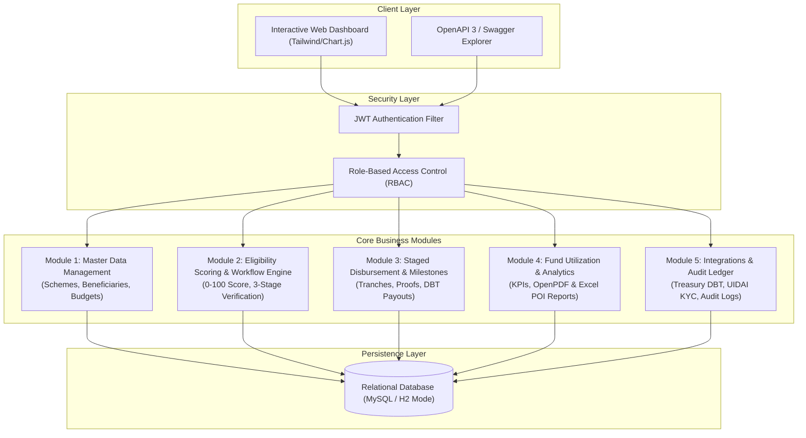

# 🏛️ Digital Subsidy & Grant Administration Platform

[](https://adoptium.net/)
[](https://spring.io/projects/spring-boot)
[](https://spring.io/projects/spring-security)
[](https://hibernate.org/)
[](https://www.mysql.com/)
[](https://swagger.io/)
[](https://tailwindcss.com/)
[](https://www.chartjs.org/)
[](https://poi.apache.org/)
[](https://github.com/LibrePDF/OpenPDF)

A production-grade, enterprise e-Governance solution for administering central government subsidies, direct benefit transfers (DBT), automated eligibility scoring, and multi-stage workflow verification.

---

## 🛠️ Technology Stack

| Layer | Technology | Purpose |
| :--- | :--- | :--- |
| **Backend Framework** |  | REST API microservices architecture |
| **Language** |  | Core enterprise business logic |
| **Security & Auth** |   | Stateless JWT authentication & Role-Based Access Control (RBAC) |
| **Persistence / ORM** |   | Entity-relational mapping & repository layer |
| **Database** |   | Embedded in-memory DB with pre-seeded demo data |
| **API Documentation** |  | Interactive REST endpoint playground |
| **Document Generation** |   | Dynamic generation of executive PDF and Excel (.xlsx) financial reports |
| **Frontend UI** |   | Single-page interactive administration portal |

---

## 🏛️ System Architecture



---

## 📦 Module Breakdown

### 🔹 Module 1: Beneficiary & Scheme Master Data Management
* **Beneficiary Registry**: 12-digit Aadhaar regex validation, demographic records, bank account/IFSC details, and socio-economic category mapping (`SC`, `ST`, `OBC`, `GENERAL`, `MARGINAL_FARMER`, `WOMEN_HEADED`).
* **Scheme Catalog**: Multi-sectoral schemes (*PM Kisan*, *PM Awas*, *PM Surya Ghar*), category rules, age constraints, income ceilings, and grant amount slabs.
* **Regional Budget Allocation**: District and State-level quota caps and utilization tracking.

### 🔹 Module 2: Eligibility Scoring & 3-Level Verification Workflow Engine
* **Automated Scoring Algorithm**: Evaluates applicants from **0 to 100** based on Age (20 pts), Income ratio (25 pts), Social category (25 pts), Landholding compliance (20 pts), and KYC documentation (10 pts).
* **Decision Rules**: >= 70 -> `ELIGIBLE`, 50-69 -> `BORDERLINE_REVIEW`, < 50 -> `INELIGIBLE`.
* **Sequential 3-Stage Pipeline**:
  1. **Field Officer**: Ground inspection & asset verification notes.
  2. **District Collector**: District quota check and policy compliance review.
  3. **Finance Approver**: Grant sanction & automated trigger for tranche schedule generation.

### 🔹 Module 3: Staged Disbursement & Milestone Compliance Tracking
* **Milestone Tranche Model**: Splits grants into progressive releases (e.g., *Tranche 1: 30% Advance*, *Tranche 2: 40% Mid-Stage*, *Tranche 3: 30% Final Utilization*).
* **Direct Benefit Transfer (DBT)**: Real-time Treasury transfer simulation with unique UTR number generation.
* **Non-Compliance Alerts**: Automated audit sweeps detecting overdue milestones and issuing reminder alerts.

### 🔹 Module 4: Fund Utilization & Regional Analytics
* **Interactive Dashboards**: High-level KPIs, scheme budget bar charts, and demographic pie charts.
* **Regional Utilization Ledger**: District-wise budget allocation vs. expenditure.
* **One-Click Document Export**:
  * **Executive PDF Report**: Built on-the-fly using **OpenPDF**.
  * **Multi-Sheet Financial Ledger**: Built with **Apache POI (.xlsx)**.

### 🔹 Module 5: Security, Integrations & Immutable Audit Logging
* **Enterprise Security**: Stateless JWT authentication with `@PreAuthorize` method protection.
* **External Mock Gateways**:
  * **Treasury DBT Gateway**: PFMS bank payout simulator.
  * **UIDAI & Bank KYC**: Instant Aadhaar validation and account seeding check.
* **Compliance Audit Trail**: Immutable AOP ledger capturing timestamp, actor, role, entity, state transitions, and remarks for CAG audits.

---

## 👥 Seed Test Users & Personas

All accounts use the default password: **`password123`**

| Username | Role | Full Name & Title | Assigned Region |
| :--- | :--- | :--- | :--- |
| `admin` | `ROLE_ADMIN` | Platform Administrator | NATIONAL |
| `field_officer` | `ROLE_FIELD_OFFICER` | Rajesh Verma (Field Officer) | Pune District |
| `district_officer` | `ROLE_DISTRICT_OFFICER` | Dr. Sunita Sharma (District Collector) | Pune District |
| `finance_officer` | `ROLE_FINANCE_OFFICER` | Amitabh Sen (Finance Director) | Central Treasury |
| `auditor` | `ROLE_AUDITOR` | Pooja Hegde (CAG Auditor) | NATIONAL |
| `ramesh_kumar` | `ROLE_BENEFICIARY` | Ramesh Kumar (Citizen) | Pune District |

> 💡 **Tip**: Use the **1-Click Persona Switcher** at the top-right of the dashboard to instantly change roles without manual login!

---

## 🚀 Quick Start & Installation

### Prerequisites
* **Java JDK 17, 21, or 24** installed (`java -version`)
* **Maven** (optional, wrapper/executable JAR included)

### 1. Clone the Repository
```bash
git clone https://github.com/YOUR_USERNAME/YOUR_REPOSITORY_NAME.git
cd YOUR_REPOSITORY_NAME
```

### 2. Run the Application

#### Option A: Run Pre-Built Executable JAR (Fastest)
```powershell
java -jar target/digital-subsidy-platform-1.0.0.jar
```

#### Option B: Run via Maven
```powershell
mvn spring-boot:run
```

### 3. Open in Browser
* **Interactive Web Dashboard**: http://localhost:8080

---

## 🧪 Running Automated Tests

Run the full test suite verifying scoring algorithms, workflow state machines, and disbursement logic:
```bash
mvn test
```

---

## 📄 License
This project is licensed under the MIT License.
